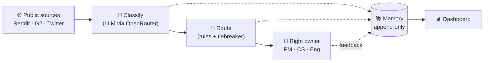

# Resound

A customer-signal intelligence layer. Resound ingests every public touchpoint about a brand — reviews, social posts, forum discussions — classifies and diagnoses each signal, and routes it to the single internal owner who can act on it. Every signal, route, and outcome accumulates in an append-only memory layer that becomes the brand's living database of customer voice.

> **Status:** v1. Reddit (via Composio managed OAuth, with PRAW available as a toggle) + G2 + Twitter ingestion, OpenRouter-backed classification, rules-based routing, file feedback, Streamlit dashboard. Two brand bundles ship: `liquiddeath` (DTC consumer demo) and `fulfil` (B2B SaaS — the pitch artifact).

See [`docs/PRD.md`](docs/PRD.md) for the full product spec.

## Architecture in one sentence

Five modular layers — Source → Classifier → Router → Memory → Feedback — each defined by an ABC, each pluggable per brand via six configuration files in `brands/<slug>/`.



A signal flows left-to-right: ingested from a public source, classified by an LLM, routed to the one person who can act, with everything written to memory along the way. The dashboard reads memory; feedback from the owner flows back in.

```
brands/<slug>/
  brand.yaml           # name, description, contacts
  sources.yaml         # which adapters and parameters
  understanding.md     # taxonomy, glossary, examples for the classifier
  routing.yaml         # routing rules
  people.yaml          # owner ID → destination resolution
  views.yaml           # saved dashboard views and alert thresholds
  models.yaml          # (optional) per-brand model overrides
```

Adding a new brand = writing the bundle. No code changes.

## Prerequisites

- **Python 3.11+**
- **[uv](https://docs.astral.sh/uv/)** — this project uses `uv` for environment and dependency management. The repo ships a `uv.lock`. `pip install -e .` will not work cleanly; use `uv sync`.
- An **OpenRouter** account (one API key, ~300 models): https://openrouter.ai/keys
- A **Composio** account for Reddit ingestion: https://platform.composio.dev (recommended, see why below)

## Setup

### 1. Clone and install

```bash
git clone <repo-url> resound
cd resound
uv sync
```

`uv sync` reads `pyproject.toml` + `uv.lock` and creates `.venv/` with all dependencies. Activate it with `.\.venv\Scripts\Activate.ps1` (Windows) or `source .venv/bin/activate` (macOS/Linux), or just prefix commands with `uv run`.

### 2. Configure credentials

```bash
cp .env.example .env
```

Fill in the keys per the sections below. Never put real values in `.env.example` — that file is committed to git.

#### OpenRouter (required)

Used for classification, filtering, and routing tiebreakers across the pipeline.

```
OPENROUTER_API_KEY=sk-or-v1-...
```

Get the key from https://openrouter.ai/keys. Model selection lives in [`config/models.yaml`](config/models.yaml) with optional per-brand overrides at `brands/<slug>/models.yaml`. Browse the OpenRouter catalog at https://openrouter.ai/models. See [`docs/design_decisions.md`](docs/design_decisions.md) for the merge semantics.

#### Reddit — choose a backend

As of November 2025, Reddit's [Responsible Builder Policy](https://support.reddithelp.com/hc/en-us/articles/42728983564564-Responsible-Builder-Policy) gates self-service script-app credentials behind a manual approval queue (typically ~7 days, often rejected). Two paths around this:

**Option A: Composio (recommended)** — routes through Composio's managed Reddit OAuth app. No Reddit API approval needed; you OAuth your personal Reddit account against Composio once.

```
REDDIT_BACKEND=composio
COMPOSIO_API_KEY=ak_...
COMPOSIO_USER_ID=your-chosen-string
COMPOSIO_TOOLKIT_VERSION_REDDIT=20260424_00
```

Steps:

1. Sign up at https://platform.composio.dev → Settings → API Keys → copy your `COMPOSIO_API_KEY`.
2. Pick any string for `COMPOSIO_USER_ID` — it's an internal label that scopes connections to a user. Single-user demos: anything consistent works (`default`, your email prefix, etc.).
3. Connect your Reddit account:
   ```bash
   uv run python scripts/connect_composio_reddit.py
   ```
   The script prints a `connect.composio.dev/link/...` URL. Open it in your browser, log into Reddit, click Allow. The script waits for the callback and prints `Connected. account_id=...`. Pass `--reset` to clear stale FAILED connections before retrying (e.g. after Reddit OAuth rate-limits).
4. Pin the toolkit version. Composio requires an explicit version for manual `tools.execute(...)` calls (the SDK default `latest` is rejected). Look up the current version:
   ```bash
   uv run python -c "from composio import Composio; from resound.config import env; c = Composio(api_key=env('COMPOSIO_API_KEY')); print(c.toolkits.get(slug='reddit').meta.available_versions[:5])"
   ```
   Set the most recent stable version (typically the latest entry that isn't a same-day patch) as `COMPOSIO_TOOLKIT_VERSION_REDDIT`.

**Option B: PRAW (direct Reddit API)** — works only if you have grandfathered credentials issued before Nov 2025, or you've gone through Reddit's Developer Support approval.

```
REDDIT_BACKEND=praw
REDDIT_CLIENT_ID=
REDDIT_CLIENT_SECRET=
REDDIT_USER_AGENT=resound:v0.1.0 (by /u/your_reddit_username)
```

Get credentials from https://www.reddit.com/prefs/apps (script-type app).

#### Twitter (optional, stub in v1)

```
TWITTER_BEARER_TOKEN=
```

Only needed when you enable the Twitter source in a brand's `sources.yaml`. Get one from https://developer.twitter.com.

### 3. Verify the bundle

```bash
uv run resound healthcheck --brand liquiddeath
```

You should see source counts, rule counts, and green checks for `OPENROUTER_API_KEY` plus the Reddit-backend-specific credentials.

### 4. Run the pipeline

Two brand bundles ship by default:

- `liquiddeath` — DTC consumer brand demo. Reddit-heavy, G2 disabled (not relevant for a beverage brand).
- `fulfil` — B2B SaaS demo (the pitch artifact). Reddit + G2 active, Twitter ready when you add a bearer token.

```bash
# Single ingest cycle:
uv run resound poll-once --brand liquiddeath

# Or run on a loop:
uv run resound run --brand liquiddeath --interval-seconds 300
```

The first run hits the configured source(s), classifies each new post via the OpenRouter model from `config/models.yaml`, routes per the rules, and writes everything to:

- `data/resound.db` — SQLite memory layer (auto-created on first run)
- `data/routes/<brand>/<date>.jsonl` — file feedback log

### 5. Open the dashboard

```bash
uv run resound dashboard --brand liquiddeath
```

Streamlit launches at http://localhost:8501 with three views:

1. **Live feed** — most recent ingested signals.
2. **Memory browser** — all persisted signals, filterable, exportable as CSV.
3. **Routing audit** — which rule fired, where each signal went, volume by owner.

## Production Backend Preview

The production-shaped backend uses FastAPI for commands/reads, Postgres for durable state,
Temporal workers for long-running ingestion/report workflows, LangGraph-compatible agents for
bounded report and memory tasks, and OpenRouterGateway as the only LLM access path.

Local production stack:

```bash
docker compose up postgres temporal
uv run alembic upgrade head
uv run resound api --host 127.0.0.1 --port 8000
uv run resound worker
```

See [`docs/runbooks/production-backend.md`](docs/runbooks/production-backend.md) and
[`docs/runbooks/temporal-workers.md`](docs/runbooks/temporal-workers.md) for deployment order,
required environment variables, worker scaling, and common recovery paths.

## Helper scripts

The `scripts/` directory contains read-only operational utilities. None of them mutate the DB.

| Script | Purpose |
|---|---|
| [`scripts/connect_composio_reddit.py`](scripts/connect_composio_reddit.py) | One-shot OAuth bootstrap for Composio's Reddit toolkit. Idempotent (skips if connection is already ACTIVE); use `--reset` to clear FAILED connections before retrying. |
| [`scripts/inspect_ignored.py`](scripts/inspect_ignored.py) | Print every signal whose route landed on `ignored_by_classifier`, with classification details. Use `--since-id N` to filter to a specific batch. Useful for auditing whether the noise filter is correctly rejecting search-query false positives. |
| [`scripts/inspect_routed.py`](scripts/inspect_routed.py) | Print every routed (non-ignored) signal with its classification, routing rule, and owner. Includes a per-owner / per-area / per-action distribution summary. |
| [`scripts/reclassify_fallbacks.py`](scripts/reclassify_fallbacks.py) | A/B test: re-run historical signals through the *current* classifier + router config without writing to the DB. Default mode targets fallback-classified rows; `--ids 10,2` mode targets specific signal IDs. Useful when tuning `understanding.md` or `routing.yaml` to verify a change without polluting the dedup table. |

Example:
```bash
uv run python scripts/inspect_routed.py --since-id 50
uv run python scripts/reclassify_fallbacks.py --brand liquiddeath --ids 10,2
```

## Adding a new brand

1. Copy an existing bundle: `cp -r brands/liquiddeath brands/yourbrand`.
2. Edit the six files. `understanding.md` matters most — give the classifier good examples. Document brand-specific product names, jargon, and severity guidance there.
3. Configure routing in `routing.yaml`. Match against any classification field (`area`, `severity`, `sentiment`, `action_class`, `confidence`) plus `source`. Rules evaluate in order; first match wins. Default route catches everything else.
4. Map owner IDs to destinations in `people.yaml`.
5. (Optional) Override classifier model per-brand in `models.yaml`.
6. Run `uv run resound healthcheck --brand yourbrand`, then `uv run resound poll-once --brand yourbrand`.

## Adding a new source

1. Create `src/resound/sources/<source>.py` subclassing `SourceAdapter`.
2. Implement `poll() -> Iterable[RawSignal]`.
3. Register it in `src/resound/sources/__init__.py` `REGISTRY`.
4. Document its expected `params` in the docstring.

The pipeline, classifier, router, memory, and dashboard pick it up automatically.

## Project layout

```
resound/
├── docs/PRD.md
├── pyproject.toml
├── uv.lock
├── .env.example
├── brands/
│   ├── liquiddeath/        # canonical example bundle (DTC consumer)
│   └── fulfil/             # B2B SaaS demo bundle
├── config/
│   └── models.yaml         # global LLM stage config (filter / classify / etc.)
├── src/resound/
│   ├── agents/             # audited agent tools and report/memory agents
│   ├── core/               # the five ABCs
│   ├── db/                 # database engine/session lifecycle
│   ├── sources/            # ingestion adapters
│   │   ├── reddit.py       # PRAW + Composio backends, dispatched by REDDIT_BACKEND
│   │   ├── g2.py
│   │   └── twitter.py
│   ├── classifiers/        # OpenRouter classifier
│   ├── routers/            # rules-based router with predicate DSL
│   ├── memory/             # SQLAlchemy-backed Memory + LLM/workflow/agent audit
│   ├── reports/            # role report templates and generation helpers
│   ├── workflows/          # Temporal workflows and activities
│   ├── workers/            # Temporal worker entrypoints
│   ├── feedback/           # file-based feedback channel
│   ├── gateway/            # OpenRouter client with fallback chain
│   ├── prompts/            # versioned LLM prompts
│   ├── dashboard/app.py    # Streamlit UI
│   ├── pipeline.py         # wires the five layers
│   ├── models.py           # Pydantic contracts
│   ├── config.py           # brand config loader
│   └── cli.py              # Typer CLI (poll-once, run, healthcheck, dashboard)
├── scripts/                # read-only operational helpers
└── tests/
```

## Troubleshooting

- **`No module named pip`** — your `uv`-created venv intentionally omits pip. Use `uv sync` to install dependencies, not `pip install`. If you really need pip, run `python -m ensurepip --upgrade` first.
- **`unable to open database file`** — `data/` directory missing. Resound auto-creates it on first run; if it persists, check directory permissions.
- **Composio `Connection ... entered terminal state 'FAILED'`** — Reddit's OAuth endpoint rate-limited Composio's managed app (shared across all Composio users). Wait 10–15 minutes and re-run `scripts/connect_composio_reddit.py --reset`.
- **Composio `No connected account found for user ID X`** — the OAuth was completed under a different `user_id` than `COMPOSIO_USER_ID` in `.env`. Run the verification one-liner under "Reddit setup" to see which user_id has the active connection.
- **Composio `Toolkit version not specified`** — set `COMPOSIO_TOOLKIT_VERSION_REDDIT` per the setup steps.
- **`Classification validation failed: None is not a valid Sentiment`** — the classifier model returned malformed JSON for a signal. Pipeline falls back to a stub IGNORE classification and continues. If this happens frequently (>10% of signals), bump the classify model in `config/models.yaml` to something stronger (e.g. Sonnet over Haiku). The shipped default is Sonnet 4.6 specifically because of this.
- **Windows: `UnicodeEncodeError: 'charmap' codec`** — Python's stdout defaults to cp1252 on Windows, which can't render emoji or arrows in some Reddit content. Helper scripts force `sys.stdout.reconfigure(encoding="utf-8")` for this reason.

## Roadmap

- **v1** ✅: Reddit (Composio + PRAW backends) + G2 + Twitter sources, OpenRouter classifier with fallback chains, rules router, file feedback, Streamlit dashboard. Two brand bundles (`liquiddeath`, `fulfil`).
- **v1.1**: Slack feedback channel; cross-source deduplication (catch the same complaint surfacing across Reddit + Twitter + G2).
- **v2**: Learned routing (use feedback events to adjust rule confidence over time); LLM-assisted brand onboarding (auto-draft `understanding.md` from the brand's help docs); outcome tracking (did the complaint pattern stop after the action shipped?).
- **v3**: Multi-tenant deployment; customer-facing portal where merchants see their own routed signals (the Fulfil-customer extension angle).

## License

Proprietary.
