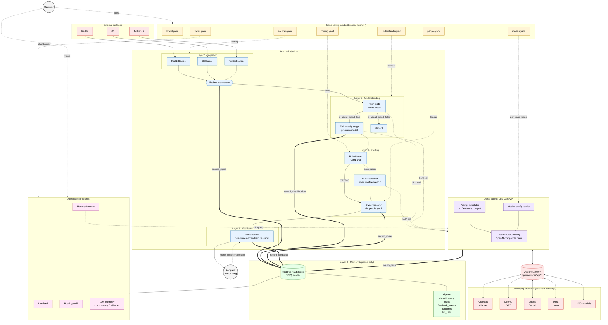
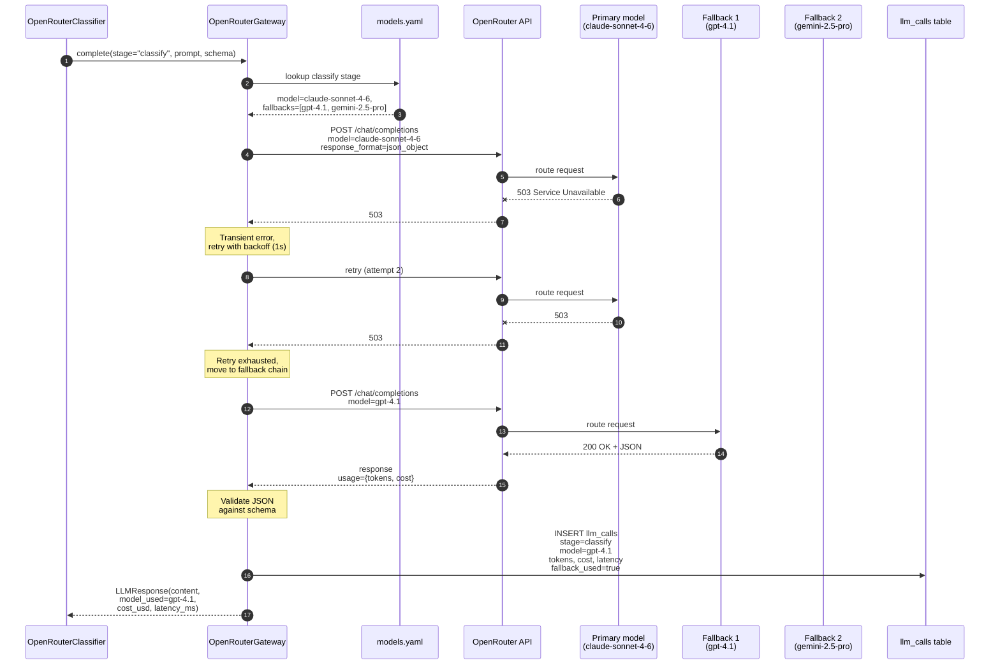
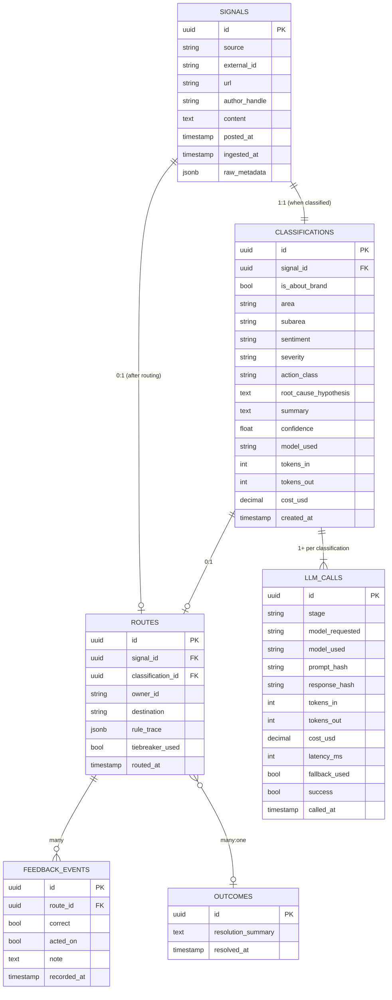

# Resound — Architecture Diagrams

Companion to [PRD-openrouter.md](PRD-openrouter.md). Three diagrams:

1. **System flow** — the full pipeline, end to end.
2. **LLM Gateway internals** — how a single classify call works, including fallbacks.
3. **Data model** — the append-only memory schema.

---

## 1. System flow

End-to-end view of one signal's journey from external source to routed notification, with config inputs and dashboard outputs.

### How to read it

- **Red boxes** are external systems (sources + LLM providers behind OpenRouter).
- **Yellow boxes** are config files the operator edits — no code paths cross out of these.
- **Blue boxes** are pipeline layers (1, 2, 3, 5).
- **Purple box** is the LLM gateway — every dotted "LLM call" arrow into it is a place the model is decoupled from the call site.
- **Green box** is the memory layer (Postgres / Supabase / SQLite).
- **Pink box** is the dashboard.
- **Solid arrows** = data flow. **Dotted arrows** = config / prompts / observability. **Thick arrows (==>)** = writes to memory.

Notice every LLM call (filter, classify, tiebreaker, NL memory query) routes through the same gateway, and the gateway is the only thing that talks to OpenRouter. That's the swap-the-model property: change `models.yaml`, the gateway picks a different slug, no other layer notices.

---

## 2. LLM Gateway internals — one classify call

What happens inside the gateway for a single classification, including the retry/fallback chain.

### Key behaviors visible here

- **Single chokepoint:** the classifier never sees model slugs — it just asks for "classify stage."
- **Config-driven:** the model is resolved from `models.yaml` at call time, not at startup, so changes only need a process restart.
- **Transient vs permanent split:** 5xx and 429 retry on the same model; 4xx (other than 429) skip immediately to fallback.
- **Audit trail:** every attempt — including the failed primary — gets logged so the dashboard can show fallback rate by model.
- **Caller-observable failure mode:** if all models in the chain fail, `LLMGatewayError` is raised, the orchestrator records the signal with no classification, and the dashboard surfaces it for manual review.

---

## 3. Data model

The memory schema. Everything is append-only; nothing is ever updated except feedback acknowledgement flags.

### Why this shape

- **`signals` is the immutable root.** Every later table foreign-keys to it.
- **`classifications` carries the model audit fields** (`model_used`, `tokens_in`, `tokens_out`, `cost_usd`) directly so the dashboard can attribute cost and quality without joins.
- **`llm_calls` is the granular ledger** — one row per LLM invocation, including the failed-primary attempts that triggered fallbacks. Reconciles to OpenRouter's billing dashboard within ±10%.
- **`outcomes` is many-to-one with routes** because a single ship/fix can resolve dozens of signals across sources — that's the cross-source dedup story we punted to v2.
- **No mutation paths.** The only column that changes after creation is feedback acknowledgement on `feedback_events`, and even that is recorded as a new event in v2.
