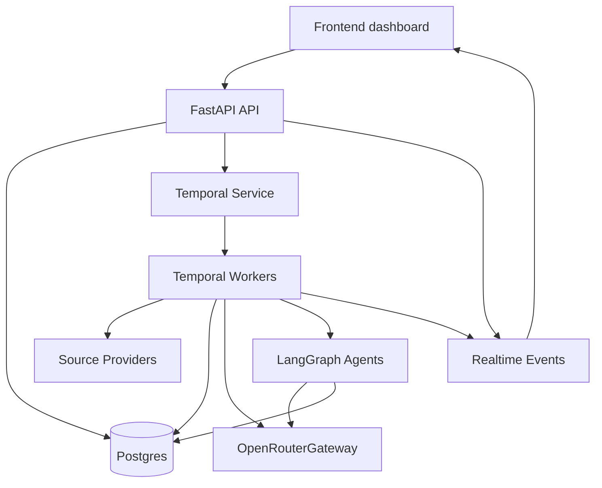
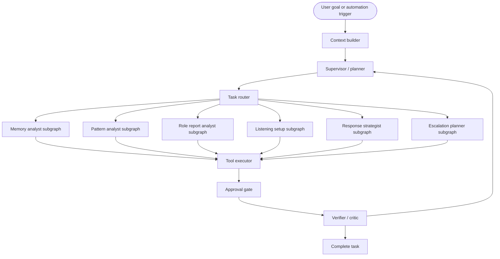
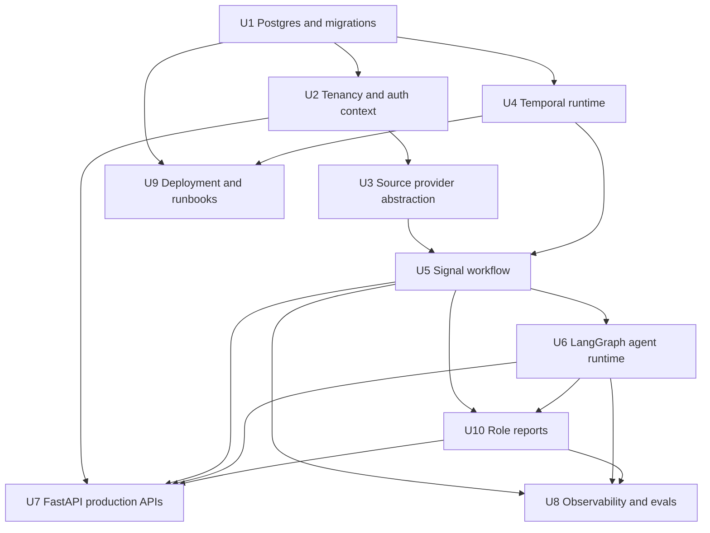

# feat: Production Backend Orchestration

## Summary

This plan evolves Resound from a demo-oriented synchronous FastAPI/OpenRouter pipeline into a production SaaS backend built on the finalized stack: **FastAPI + Postgres + Temporal + LangGraph + OpenRouterGateway**. V1 centers on Apify-powered public listening, customer-specific paid workspaces, and persisted team-personalized reports over already-ingested social data.

---

## Problem Frame

Resound needs a focused production path before connected-account complexity: curated public brand pages for 2-3 demo brands, and paid workspaces where customers configure public listening and generate role-specific intelligence reports for teams like Founder, Product, Marketing, Engineering, and CS. The current backend proves the core AI classification/routing concept, but it still runs synchronously, defaults to SQLite, lacks durable workflow execution, and has no tenant/report model for SaaS.

---

## Requirements

- R1. Finalize the backend stack around FastAPI, Postgres, Temporal, LangGraph, and the existing OpenRouterGateway.
- R2. Preserve the current layer boundary: source ingestion normalizes into `RawSignal`, AI understanding produces `Classification`, routing produces `Route`, memory persists append-only records, and feedback closes the loop.
- R3. Support Apify-powered public listening as the V1 ingestion mode for public demo pages and paid customer workspaces.
- R4. Make source providers replaceable so Apify/prototype adapters can be swapped for native APIs later without changing downstream AI orchestration.
- R5. Move heavy LLM and ingestion work out of FastAPI request handlers into durable background workflows.
- R6. Keep OpenRouterGateway as the single chokepoint for model selection, fallbacks, cost tracking, JSON handling, and provider access.
- R7. Use LangGraph only for reasoning-heavy, stateful agent workflows; do not force every high-volume classification through a long agent loop.
- R8. Add production-grade tenant isolation, auditability, LLM telemetry, workflow state, and agent traceability.
- R9. Provide a backend surface that the existing/new frontend can use for live dashboards, report generation, report history, source freshness, and agent activity.
- R10. Provide role-personalized persisted reports for Founder, Product, Marketing, Engineering, and CS teams.
- R11. Generate reports from stored data only by default, with visible per-source freshness metadata.
- R12. Keep connected owned accounts and Buffer integration out of V1 implementation scope, while preserving them as a V1.5 extension path.
- R13. Provide guided agent-assisted paid onboarding that creates a durable `ListeningProfile` for each customer brand.
- R14. Store report configs as team-owned artifacts and make report runs visible to the owning team by default.
- R15. Public demo brand pages may show a delayed, capped, moderated public feed, but must not expose unrestricted export/API access to all ingested signals.
- R16. Retain uncited raw public listening signals for 12 months by default, while retaining full raw text for report-cited signals indefinitely as report evidence.
- R17. V1 Apify public listening sources are Reddit, YouTube comments, TikTok, Instagram public, and X public.
- R18. Customer-facing reports must pass the V1 quality gate: fixed role sections, citations for major claims, low-data caveats when evidence is thin, and internal usefulness rating of at least 4/5.

---

## Scope Boundaries

- This plan does not implement the full frontend redesign; it defines backend APIs and events the frontend can consume.
- This plan does not require replacing Apify immediately; Apify is the V1 public-listening provider behind a replaceable adapter boundary.
- This plan does not require native social APIs in the first release. It designs the adapter boundary so Reddit, YouTube, Bluesky, Meta, TikTok, LinkedIn, X, and Buffer can be added incrementally later.
- This plan does not include billing/subscription implementation, though it preserves the public vs paid mode distinction needed for billing later.
- This plan does not include autonomous posting to public social accounts without human approval.
- This plan does not include self-hosted LLM serving; OpenRouter remains the model gateway.
- This plan does not include connected owned-account inboxes, Buffer posting, or Buffer analytics in V1.
- This plan does not allow raw unrestricted public mirrors of all ingested demo-brand content; public feeds require delay, caps, moderation, and hide/takedown controls.

### Deferred to Follow-Up Work

- Billing, subscription enforcement, and usage-based pricing: separate product/backend plan after tenant and workflow foundations exist.
- Full native API rollout for every social platform: separate source-adapter plans per provider.
- Connected owned accounts and Buffer integration: V1.5 after public-listening reports prove demand. Buffer can be revisited as a publishing/metrics adapter, not the V1 listening core.
- Advanced analytics warehouse or ClickHouse-style event analytics: follow-up after Postgres-backed reporting reaches real volume limits.
- SOC2 evidence automation and enterprise compliance package: follow-up after audit events, tenancy, and deployment runbooks exist.

---

## Context & Research

### Relevant Code and Patterns

- `src/resound/pipeline.py` is the current orchestration point and should be decomposed into workflow activities rather than discarded.
- `src/resound/gateway/openrouter.py`, `src/resound/gateway/base.py`, and `config/models.yaml` already provide the model boundary this plan should preserve.
- `src/resound/classifiers/openrouter.py` and `src/resound/prompts/classify.py` show the current structured classification pattern.
- `src/resound/memory/__init__.py` contains the current SQLAlchemy schema and `llm_calls` ledger, but it still uses `Base.metadata.create_all()` and a per-`SqlMemory` engine.
- `src/resound/api/app.py`, `src/resound/api/routes/*`, `src/resound/api/projections.py`, and `src/resound/api/schemas.py` are the current FastAPI/API projection layer.
- `src/resound/core/*` defines the existing layer interfaces and should remain the domain boundary for source, classifier, router, memory, and feedback behavior.
- `brands/<slug>/` bundles and optional `brands/<slug>/models.yaml` are the current brand configuration convention and should be mapped into tenant-owned database/config records without losing the local-dev file workflow.

### Institutional Learnings

- `docs/design_decisions.md` locks the OpenRouterGateway as the model-selection and retry/fallback boundary. Future agent nodes should call through this gateway rather than importing provider SDKs directly.
- `docs/design_decisions.md` also locks the audit-write pattern: orchestration writes `llm_calls`; the gateway stays pure compute.
- `docs/ARCHITECTURE.md` describes planned filter, classify, routing tiebreaker, and memory-query stages. Current code only wires classify, so production work should implement missing stages deliberately rather than assume they exist.
- There is no `docs/solutions/` institutional learning directory in this repo yet.

### External References

- Temporal Python docs: Workflows, Activities, Workers, testing, versioning, schedules, and observability are first-class Python SDK concepts.
- Temporal production deployment docs: local development can use `temporal server start-dev`; production requires either Temporal Cloud or a self-hosted Temporal Service plus independently deployed/scaled application Workers.
- LangGraph docs: LangGraph is a low-level orchestration runtime for long-running, stateful agents with persistence, streaming, human-in-the-loop, and debugging support; it can be used without forcing all LLM calls through LangChain abstractions.

---

## Key Technical Decisions

| Decision | Rationale |
|---|---|
| Use Postgres as the production source of truth before adding Temporal workflows. | Durable workers need idempotent, queryable state and migrations before the orchestration layer starts depending on database contracts. |
| Introduce Alembic migrations and stop relying on `create_all()` for production. | The repo already lists Alembic but has no real migrations; enterprise SaaS needs controlled schema evolution. |
| Keep FastAPI focused on API, auth context, command creation, query projection, and realtime event delivery. | Request handlers should not perform source polling, multi-step classification, or long-running agent work. |
| Use Temporal for durable workflow execution and retries. | Signal ingestion, classification, routing, notifications, backfills, and source syncs need restart-safe state, retry policies, and operational visibility. |
| Use LangGraph inside selected Temporal activities/workflows for reasoning-heavy agents. | Temporal owns durability; LangGraph owns agent state transitions, tool use, human-in-the-loop reasoning, and streaming agent progress. |
| Preserve OpenRouterGateway as the only LLM gateway. | This keeps model choice, fallbacks, audit metadata, and provider switching consistent across simple classifier calls and LangGraph nodes. |
| Keep high-volume signal classification mostly deterministic. | A cheap filter + structured classify call is cheaper, faster, and easier to evaluate than a free-form multi-agent loop per signal. |
| Normalize every source into `RawSignal` plus provider metadata. | Public listening, connected owned accounts, Apify, and native APIs can change independently from classification/routing. |
| Require human approval for external actions. | Enterprise social teams need AI-assisted drafts and escalations, not uncontrolled public replies. |
| Add action parity between frontend operations and agent tools. | If a social team can reroute, mark feedback, draft responses, create patterns, or search memory in the UI, bounded agents should be able to perform the same operation through audited tools. |
| Make V1 a public-listening report product. | The paid V1 value is customer-specific public listening and personalized reports, not connected owned-account inboxes. |
| Use role templates plus editable saved report configs. | Founder, Product, Marketing, Engineering, and CS reports need stable sections for comparison over time, while still allowing customer-specific filters and edits. |
| Persist every report run as a durable artifact. | Reports need citations, timeframe, role/team context, export/share surfaces, and history; they should not be transient chat answers. |
| Generate reports from stored data only by default. | Dashboard ingestion runs frequently, so report generation should be fast and reliable instead of kicking off Apify jobs on demand. |
| Use plain LangGraph first for the report/copilot harness. | Deep Agents may be useful later, but plain LangGraph supervisor graphs are enough until report/copilot complexity proves otherwise. |
| Guided onboarding creates a `ListeningProfile`. | Public listening quality depends on durable brand/product/competitor/exclusion/source configuration, not one-off prompts. |
| Report configs are team-owned; report runs are team-visible by default. | Role reports are operational team artifacts, so continuity and shared visibility matter more than private user drafts. |
| Public demo feeds are delayed, capped, and moderated. | Public pages can prove the system is working without becoming an unrestricted scraped-content export surface. |
| Raw retention has a report-citation exception. | Uncited raw signals expire after 12 months, but report-cited full text is retained indefinitely so persisted reports remain auditable. This is intentionally riskier than capped excerpts and must be explicit. |
| V1 source set is five public Apify sources. | Reddit, YouTube comments, TikTok, Instagram public, and X public provide enough social breadth for reports while keeping LinkedIn/Facebook public out unless customer demand justifies them. |
| Report quality has an explicit release gate. | A report is not customer-facing just because it generated; it must be cited, caveated when data is thin, structurally valid, and rated useful in internal review. |

---

## Open Questions

### Resolved During Planning

- Which stack should be finalized? FastAPI + Postgres + Temporal + LangGraph + OpenRouterGateway.
- Should Apify be allowed during development? Yes, but only behind a source-provider adapter that emits normalized `RawSignal` objects.
- Should LangGraph replace the whole pipeline? No. LangGraph should power reasoning-heavy agents; deterministic high-volume stages should stay simple and auditable.
- What is paid V1? Customer-specific public listening with team-personalized persisted reports and configurable routing/report context.
- What is public V1? Curated public listening pages for only 2-3 demo brands, showing overall brand listening without routing customization.
- What happens to Buffer? Defer Buffer to V1.5. Buffer may become a publishing/metrics adapter, but it is not the V1 listening/reporting core.
- Should reports trigger fresh ingestion? No. Reports use stored data by default and display data freshness.
- What report templates are required? Founder, Product, Marketing, Engineering, and CS.
- How does paid onboarding configure listening? Guided agent setup creates a durable `ListeningProfile`.
- Who owns report configs/runs? Report configs are team-owned and report runs are team-visible by default.
- How much evidence do public demo pages expose? They can show a delayed, capped, moderated feed with no export/API and hide/takedown controls.
- What is the retention policy? Uncited raw public signals expire after 12 months; full raw text for report-cited signals is retained indefinitely as report evidence.
- Which public sources does V1 ingest? Reddit, YouTube comments, TikTok, Instagram public, and X public through Apify.
- What is the report quality bar? Fixed role sections, citations for major claims, low-data caveats, and internal usefulness rating >=4/5 before customer-facing release.

### Deferred to Implementation

- Temporal Cloud vs self-hosted Temporal Service: deployment choice depends on cost, target customer requirements, and hosting strategy.
- Auth provider choice: the plan needs tenant/auth boundaries, but final provider selection can be decided when implementing enterprise auth.
- Exact API shapes for every future social provider: the Apify adapter contract should be implemented first, then provider-specific payload mapping can be resolved per source in follow-up work.
- Exact LangGraph checkpoint persistence backend: choose during implementation based on the LangGraph version and how much state Temporal already persists.
- Whether to add `pgvector` in the first production pass: useful for memory search, but it should not block the core workflow migration.
- Exact Buffer API capabilities for comments/replies: deferred to V1.5 technical spike because public Buffer docs confirm channels/posts/metrics more clearly than inbox/comment read APIs.

---

## Output Structure

Expected new/expanded backend structure:

```text
src/resound/
  agents/              # LangGraph agent definitions, tools, and prompts
  db/                  # engine/session lifecycle and migration helpers
  tenancy/             # organization, user, membership, brand access context
  social/              # public source provider adapters; connected providers come later
  workflows/           # Temporal workflows and activities
  workers/             # Temporal worker entrypoints
  api/                 # expanded FastAPI routes/schemas/dependencies/events
migrations/            # Alembic migration environment and revisions
tests/
  agents/
  api/
  social/
  workflows/
  db/
docs/
  runbooks/
```

This is a target layout for review, not a hard constraint. Implementation may adjust module names if a smaller seam preserves the same boundaries more cleanly.

---

## High-Level Technical Design

> *This illustrates the intended approach and is directional guidance for review, not implementation specification. The implementing agent should treat it as context, not code to reproduce.*



Core execution model:

```text
FastAPI handles commands and reads.
Temporal runs durable jobs and retries.
Activities wrap source polling, normalization, LLM calls, routing, and notifications.
LangGraph runs bounded agents for role reports, memory query, pattern analysis, and open-ended investigation.
OpenRouterGateway remains the only way anything calls an LLM.
Postgres stores tenant data, workflow state pointers, LLM calls, agent steps, and audit events.
```

Public listening and future connected owned accounts share the same downstream contract:

```text
Provider payload -> Source adapter -> RawSignal -> Workflow -> AI pipeline -> Route/Pattern/Action -> Dashboard
```

For V1, connected owned accounts are deferred. The concrete V1 product flow is:

```text
Apify public listening sync
  -> RawSignal storage
  -> filter/classify/pattern preparation
  -> paid user selects team + timeframe + saved report config
  -> ReportGenerationWorkflow queries stored data only
  -> LangGraph report harness synthesizes sections with citations
  -> persisted ReportRun appears in dashboard
  -> Markdown export/share
```

Reports must display freshness metadata from the latest successful source sync. Target sync cadence is 15 minutes for paid brands and 60 minutes for curated public demo brands.

---

## V1 Listening Onboarding Model

Paid customers configure public listening through guided agent setup. The durable output is a `ListeningProfile` for each tenant brand.

| Concept | Purpose |
|---|---|
| `ListeningProfile` | Source of truth for public listening. Stores brand names, product names, competitor names, keywords, excluded terms, source toggles, cadence, locale/language assumptions, and setup-agent notes/confidence. V1 source toggles cover Reddit, YouTube comments, TikTok, Instagram public, and X public. |
| `ListeningProfileSuggestion` | Agent-proposed keyword, exclusion, competitor, or source setting that a user can accept, edit, or reject during onboarding. |
| `ListeningProfileRevision` | Audit trail for changes to listening configuration, including whether the change was user-authored or agent-suggested. |

Guided setup asks for brand basics and then has the agent propose search terms and exclusions. Users approve/edit the profile before it starts scheduled Apify sync. This prevents the ingestion layer from depending on hidden prompt state or one-off setup chats.

---

## V1 Report Product Model

V1 paid value is team-personalized social intelligence reporting over public listening data.

| Concept | Purpose |
|---|---|
| `ReportTemplate` | Built-in role template for Founder, Product, Marketing, Engineering, and CS reports. Defines fixed sections, default filters, and role-specific synthesis instructions. |
| `ReportConfig` | Team-owned customer-editable saved configuration based on a template. Defines brand, team, timeframe defaults, filters, included sources, section toggles, and recipients/cadence when scheduling is added. |
| `ReportRun` | Team-visible persisted generated artifact with role, timeframe, source freshness, sections, citations, summary, generated-at timestamp, status, and Markdown export. |
| `ReportCitation` | Link from a report section to source `RawSignal`/classification/pattern evidence. Paid reports include citations and retain the cited full raw text indefinitely as report evidence; public demo pages show aggregate summaries and only curated/limited examples. |
| `PublicFeedItem` | Moderated public projection of a stored signal for demo brand pages. Applies delay, caps, visibility state, text/snippet policy, and source-link policy separately from paid workspace access. |
| `PublicFeedModerationEvent` | Audit trail for hide/show/takedown/moderation decisions on public demo feed items. |

Initial templates:

| Template | Primary Lens | Example Sections |
|---|---|---|
| Founder | Strategic read on market/customer mood. | Executive summary, biggest risks, strongest opportunities, brand perception shifts, top evidence, recommended leadership actions, emerging themes. |
| Product | Product pain, requests, and user language. | Top product complaints, feature requests, UX friction, severity/volume, representative signals, roadmap implications, emerging themes. |
| Marketing | Campaign, positioning, sentiment, and message resonance. | Sentiment shifts, phrases customers repeat, content opportunities, competitor comparisons, testimonials, campaign reactions, emerging themes. |
| Engineering | Bugs, reliability, technical complaints, and reproducible symptoms. | Suspected defects, severity clusters, repro hints, affected platforms/features, source examples, recommended investigation queue, emerging themes. |
| CS | Support load, customer confusion, response opportunities, and escalation needs. | Top support questions, confusion drivers, urgent complaints, suggested macros, escalation candidates, representative signals, emerging themes. |

Report generation starts on-demand. Scheduled weekly/monthly reports are the next step after on-demand report quality is proven. V1 output is an in-app persisted report page plus Markdown export; PDF and email delivery are follow-up work.

Public demo pages can show a delayed, capped, moderated feed for the 2-3 curated public brands. That feed is a public projection, not the raw signal table: no unauthenticated export, no public bulk API, moderation/hide/takedown controls, and clear source links where content is displayed.

Customer-facing report release requires the V1 quality gate: each role report must keep its fixed section structure, cite evidence for major claims, include low-data caveats when evidence is thin, and receive an internal usefulness rating of at least 4/5 before being exposed to customers.

---

## Agentic Architecture

The agentic system will use a **Temporal-wrapped plain LangGraph supervisor/planner-executor architecture**. Deep Agents is deferred unless report/copilot complexity proves that plain LangGraph is not enough.

This is the concrete architecture choice:

```text
Temporal durable workflow
  -> LangGraph agent state graph
    -> Supervisor / planner node
    -> Specialist subgraphs
    -> Tool executor node
    -> Approval gate node
    -> Verifier / critic node
    -> Explicit completion node
```

This is intentionally **not** a free-form multi-agent swarm. The system should be predictable, auditable, and enterprise-safe. One supervisor graph owns the user goal, routes work to bounded specialist subgraphs, calls approved tools, and finishes with an explicit completion status. For reports, the harness is agent-led inside a fixed graph: the agent may choose bounded retrieval/synthesis tools, but the report template, allowed tools, output schema, citations, and verifier checks are fixed.

### Core Agent Graph



### Responsibilities

| Component | Responsibility |
|---|---|
| Temporal workflow | Durable execution, retries, schedules, child workflow starts, long-running waits, and recovery after process failure. |
| LangGraph state graph | Agent reasoning loop, step state, tool routing, human-in-the-loop state, and explicit completion. |
| Supervisor / planner | Understand the user goal, decompose it into bounded steps, select specialist subgraphs, and decide when work is complete. |
| Specialist subgraphs | Perform focused reasoning for role reports, memory questions, pattern analysis, investigations, and future response/escalation planning. |
| Tool executor | The only place agent actions touch product state. Tools call the same backend services/API commands the UI uses. |
| Approval gate | Blocks external or risky side effects until a human approves, edits, or rejects. |
| Verifier / critic | Checks citations, tenant scope, policy/safety rules, confidence, and whether the result satisfies the original goal. |
| OpenRouterGateway | The only LLM access path used by every node/subgraph that needs a model call. |

### Agent State

The graph should carry typed state, not an unstructured chat transcript only:

```text
AgentState
  tenant_context
  brand_context
  user_goal
  current_plan
  completed_steps
  pending_steps
  retrieved_context
  tool_results
  pending_approvals
  citations
  report_sections
  final_summary
  status: running | waiting_for_approval | completed | blocked | failed
```

### Specialist Subgraphs

| Subgraph | Use When | Typical Tools |
|---|---|---|
| Memory analyst | User asks what customers are saying, asks for historical context, or needs citations. | `search_signals`, `get_signal`, `list_patterns`, `query_analytics` |
| Pattern analyst | User asks for trends, spikes, recurring complaints, or launch reaction summaries. | `search_signals`, `create_pattern`, `update_pattern`, `get_pattern` |
| Role report analyst | User generates a Founder, Product, Marketing, Engineering, or CS report for a timeframe. | `search_signals`, `list_patterns`, `get_report_config`, `save_report_run`, `export_report_markdown` |
| Listening setup | Paid customer configures a brand's public listening profile. | `suggest_keywords`, `suggest_exclusions`, `save_listening_profile`, `preview_source_queries` |
| Response strategist | V1.5: user needs a reply, response plan, or social team messaging recommendation. | `draft_response`, `read_brand_voice`, `create_approval` |
| Escalation planner | V1.5: user needs internal routing, Jira/Slack/Zendesk summary, or owner recommendation. | `list_routes`, `reroute_signal`, `draft_escalation`, `create_approval` |
| Evaluation analyst | Operator wants model/routing quality, failure analysis, or prompt/model recommendations. | `query_llm_calls`, `list_feedback`, `compare_outputs` |

### Rules For This Architecture

- High-volume signal processing should remain deterministic and workflow-driven; do not invoke the agentic orchestrator for every signal.
- Agents must operate through domain tools, not direct database writes.
- Every tool call must be tenant-scoped and auditable.
- External side effects require approval: public replies, Slack/Jira/Zendesk sends, bulk reroutes, source config changes, and routing-rule edits.
- Agent output must include citations when it summarizes customer voice.
- Report agents must use stored data only by default; they may show freshness warnings but should not trigger ingestion automatically.
- Report verifier must reject or hold reports that lack citations for major claims, omit low-data caveats, or fail the fixed role schema.
- The graph must finish through an explicit completion node with `success`, `partial`, `blocked`, or `failed` status.
- Prompt/model selection remains stage-based through `OpenRouterGateway`; LangGraph nodes do not choose provider SDKs directly.

---

## Workflow Catalog

These are the production workflows the backend should expose through Temporal and, where needed, LangGraph. Temporal owns durable execution, retries, schedules, and long-running waits. LangGraph is used inside selected workflows for bounded reasoning, tool use, and human-in-the-loop agent state.

### V1 Workflows

| Workflow | Trigger | Primary Runtime | Purpose |
|---|---|---|---|
| `ListeningProfileSetupWorkflow` | Paid customer starts or edits brand setup | Temporal + LangGraph | Guide the customer through brand/product/competitor context, propose keywords/exclusions/source toggles, persist accepted `ListeningProfile` revisions, and prepare Apify sync config. |
| `PublicListeningSyncWorkflow` | Schedule or manual brand sync | Temporal | Pull Reddit, YouTube comments, TikTok, Instagram public, and X public mentions from Apify, normalize into `RawSignal`, update source health/freshness, and enqueue signal processing. Paid brands target 15-minute cadence; curated public demo brands target 60-minute cadence. |
| `SignalProcessingWorkflow` | New normalized signal or batch | Temporal | Dedupe, run relevance filter, classify, route, persist audit rows, emit dashboard events, and create review items when needed. |
| `ReportGenerationWorkflow` | User requests a team report for a brand/timeframe | Temporal + LangGraph | Query stored data only, run the role report analyst graph, generate fixed-section report output with citations, persist `ReportRun`, and expose Markdown export. |
| `PatternDetectionWorkflow` | Hourly/daily schedule or manual run | Temporal + LangGraph | Group related signals, detect trends/spikes, summarize patterns, attach representative examples, and suggest owner/action. |
| `MemoryQueryWorkflow` | User asks dashboard/copilot question | Temporal + LangGraph | Retrieve relevant signals, routes, patterns, outcomes, and analytics; synthesize an answer with citations. |
| `AgenticOrchestratorWorkflow` | User gives an open-ended goal, automation rule fires, or operator starts an investigation | Temporal + LangGraph | Decompose a goal into bounded steps, call approved domain tools, start child workflows, track progress, request approvals, and stop with an explicit completion status. |
| `EvaluationWorkflow` | Daily/weekly schedule, model/prompt change, or report QA review | Temporal + LangGraph optional | Sample recent outputs and human feedback to measure classification, report usefulness, citation quality, caveat quality, routing quality, and cost per useful signal. |
| `DataRetentionWorkflow` | Daily schedule | Temporal | Delete or archive uncited raw public listening signals older than 12 months while preserving full raw text embedded in report citations. |

### V1.5 Deferred Workflows

| Workflow | Trigger | Primary Runtime | Purpose |
|---|---|---|---|
| `ConnectedAccountSyncWorkflow` | OAuth connection created or scheduled account sync | Temporal | Pull owned comments, mentions, replies, posts, and account-specific objects from connected accounts when native/Buffer provider capabilities are selected. Deferred from V1. |
| `AnalyticsSyncWorkflow` | Schedule or manual account sync | Temporal | Pull owned-account metrics such as reach, impressions, engagement, followers, watch time, and clicks into analytics tables. Deferred from V1 unless Buffer/native analytics becomes a priority. |
| `ResponseDraftWorkflow` | User requests draft or auto-suggest runs | Temporal + LangGraph | Draft public/owned-account replies and create approval requests. Deferred from V1 because owned-comment inbox and posting are not V1 scope. |
| `ApprovalWorkflow` | Draft response, escalation, bulk action, or risky operation | Temporal | Wait for human approval before external side effects. Required for V1.5 posting/escalation actions. |
| `EscalationWorkflow` | Route requires internal owner or approved escalation | Temporal + optional LangGraph | Format and deliver Slack/Jira/Zendesk/Linear/email escalations. Useful later, but not core to V1 report generation. |

The normal V1 social intelligence loop is:

```text
Listen -> Process -> Pattern -> Report -> Investigate -> Learn
```

Public listening should optimize for discovery, paid role-personalized reports, and curated public demo brand pages. Connected owned accounts should optimize for paid workflow, response operations, and richer analytics in V1.5.

`AgenticOrchestratorWorkflow` is the top-level copilot/investigation loop. It should not run for every incoming signal. Use it when a user asks for an outcome that spans multiple capabilities, for example: "summarize this launch reaction and draft escalations," "investigate why sentiment dropped this week," or "prepare a response plan for this spike." It operates through the same tools and workflows the UI uses, so every action remains tenant-scoped, logged, and approval-gated.

---

## Implementation Units



### U1. Postgres and Migration Foundation

**Goal:** Move the persistence layer from demo-style SQLite/create-all behavior to production-ready Postgres with explicit migrations and app-scoped database lifecycle.

**Requirements:** R1, R2, R8

**Dependencies:** None

**Files:**
- Modify: `pyproject.toml`
- Modify: `.env.example`
- Modify: `src/resound/memory/__init__.py`
- Modify: `src/resound/api/dependencies.py`
- Create: `src/resound/db/`
- Create/modify: `migrations/`
- Test: `tests/db/test_database_lifecycle.py`
- Test: `tests/memory/test_llm_calls.py`

**Approach:**
- Add the Postgres driver dependency and formalize `RESOUND_DATABASE_URL` for production.
- Introduce a single app-level engine/session factory path instead of creating a new engine per API dependency call.
- Set up Alembic with an initial migration covering existing tables plus production additions that are known at this unit's boundary.
- Keep SQLite support only as a local/test convenience if it does not complicate the production path.
- Preserve append-only memory and the existing `llm_calls` semantics while preparing for tenant foreign keys in U2.

**Execution note:** Add characterization coverage around existing `SqlMemory` writes before changing engine/session lifecycle.

**Patterns to follow:**
- Existing table/row definitions in `src/resound/memory/__init__.py`.
- Existing `llm_calls` tests in `tests/memory/test_llm_calls.py`.

**Test scenarios:**
- Happy path: creating the app memory/session dependency should reuse configured database lifecycle and allow API projections to read persisted rows.
- Happy path: existing signal, classification, route, feedback, handoff, and `llm_calls` writes still persist with the same observable fields.
- Edge case: SQLite test database still works when explicitly configured for local tests, if retained.
- Error path: invalid or missing production database URL fails clearly at startup/worker boot rather than during a mid-request write.
- Integration: Alembic migration creates the schema needed by existing memory tests without relying on `Base.metadata.create_all()` as the production mechanism.

**Verification:**
- Existing memory and API tests pass against the new session lifecycle.
- A production Postgres URL is the documented default for deployed environments.
- Schema creation is migration-driven for production.

### U2. Tenant, Brand, and Access Model

**Goal:** Add the enterprise SaaS boundary: organizations, teams, users/memberships, brands, and access context that every API request, workflow, public source config, and report can carry.

**Requirements:** R3, R8, R9

**Dependencies:** U1

**Files:**
- Create: `src/resound/tenancy/`
- Modify: `src/resound/memory/__init__.py`
- Modify: `src/resound/api/dependencies.py`
- Modify: `src/resound/api/schemas.py`
- Modify: `src/resound/api/routes/brands.py`
- Test: `tests/api/test_tenancy.py`
- Test: `tests/db/test_tenant_isolation.py`

**Approach:**
- Introduce organization, team, user, membership, and database-backed brand records without breaking local brand-bundle development.
- Add tenant context extraction for API calls. The first implementation may use a development header/API-key pattern if a full auth provider is intentionally deferred.
- Ensure every tenant-owned read/write is scoped by organization and brand, not only by `brand_slug`.
- Map existing `brands/<slug>/` files into seeded/dev brand records or retain them as local config sources that are resolved into tenant context.

**Patterns to follow:**
- Current `brand_slug` filtering in `src/resound/api/projections.py`.
- Current brand bundle loading in `src/resound/config.py`.

**Test scenarios:**
- Happy path: a user/member of organization A can list only organization A brands and signals.
- Happy path: team members can access report configs/runs owned by their team.
- Happy path: a brand backed by existing local config still resolves its sources, routing, people, views, and model overrides.
- Edge case: two organizations can use the same display brand name without cross-reading each other's signals.
- Error path: missing tenant context returns an authorization error instead of falling back to all data.
- Error path: user from organization A cannot access a route, signal, or pattern owned by organization B.
- Integration: API projections and memory writes preserve tenant scope across signal -> classification -> route joins.

**Verification:**
- Tenant isolation is enforced in API reads and workflow write inputs.
- Existing demo brands can still be loaded for local development.

### U3. Public Source Provider Abstraction

**Goal:** Define replaceable source adapters for V1 public listening, so Apify can produce the same `RawSignal` contract that future native APIs will use, driven by each brand's `ListeningProfile`.

**Requirements:** R2, R3, R4

**Dependencies:** U2

**Files:**
- Create: `src/resound/social/`
- Modify: `src/resound/models.py`
- Modify: `src/resound/core/source.py`
- Modify: `src/resound/sources/__init__.py`
- Create/modify: `src/resound/sources/*`
- Test: `tests/social/test_source_provider_contract.py`
- Test: `tests/test_pipeline.py`

**Approach:**
- Add `ListeningProfile`, `ListeningProfileSuggestion`, and `ListeningProfileRevision` persistence for brand keywords, exclusions, products, competitors, source toggles, cadence, and setup-agent notes.
- Implement the V1 Apify source set: Reddit, YouTube comments, TikTok, Instagram public, and X public. Leave LinkedIn/Facebook public out unless a customer-specific follow-up adds them.
- Add a provider/source mode distinction that supports public listening in V1 and leaves connected owned accounts as a V1.5 extension.
- Normalize provider-specific payloads into `RawSignal` plus `raw_metadata` fields that can carry provider run IDs, engagement metrics, platform payload IDs, and account context.
- Treat Apify as the V1 provider adapter, not a product dependency below the source layer.
- Generate Apify query configs from the accepted `ListeningProfile`, not from transient chat state.
- Leave connected-account source connections and OAuth mechanics deferred to V1.5 provider units.
- Keep downstream classifier/router code ignorant of whether a signal came from Apify, Reddit native API, YouTube API, Meta Graph, or another provider.

**Patterns to follow:**
- Current `RawSignal` model in `src/resound/models.py`.
- Existing source adapters in `src/resound/sources/reddit.py`, `src/resound/sources/g2.py`, and `src/resound/sources/twitter.py`.

**Test scenarios:**
- Happy path: a public-listening provider payload normalizes into a valid `RawSignal` with source mode and provider metadata retained.
- Happy path: an Apify public-listening payload normalizes into a valid tenant/brand-scoped `RawSignal`.
- Happy path: each V1 source toggle maps to the expected Apify actor/config and source metadata.
- Happy path: accepted `ListeningProfile` settings produce deterministic provider query config for scheduled sync.
- Happy path: agent-suggested keywords/exclusions can be accepted, edited, rejected, and audited as revisions.
- Edge case: missing author, URL, or engagement metrics still creates a valid signal when content and external ID are present.
- Error path: malformed provider payload is rejected or skipped with a structured error that can be surfaced in source health.
- Integration: the existing pipeline can classify/route a normalized signal without checking provider-specific fields.

**Verification:**
- Source provider adapters are swappable behind one contract.
- Public listening mode and provider metadata are visible in stored metadata and dashboard/API surfaces.

### U4. Temporal Runtime and Worker Foundation

**Goal:** Add Temporal as the durable execution layer with local development support, worker entrypoints, task queues, and activity boundaries around existing pipeline operations.

**Requirements:** R1, R5, R8

**Dependencies:** U1

**Files:**
- Modify: `pyproject.toml`
- Modify: `.env.example`
- Modify: `src/resound/cli.py`
- Create: `src/resound/workflows/`
- Create: `src/resound/workers/`
- Test: `tests/workflows/test_worker_configuration.py`
- Test: `tests/workflows/test_activity_idempotency.py`

**Approach:**
- Add Temporal Python SDK dependency and configuration for Temporal address, namespace, task queues, and worker identity.
- Introduce worker entrypoints separate from the FastAPI server.
- Define activities for source polling, signal normalization, dedupe/write, filter/classify, route, feedback/notification, and event emission.
- Keep activities side-effecting and workflows deterministic; workflows should coordinate activity execution rather than directly touching network APIs or databases.
- Use Temporal local dev server for development and leave Temporal Cloud vs self-hosted production as a deployment decision.

**Patterns to follow:**
- Existing `resound run` and `resound poll-once` CLI flow in `src/resound/cli.py`.
- Existing pipeline orchestration in `src/resound/pipeline.py`.

**Test scenarios:**
- Happy path: worker configuration loads expected task queue and Temporal connection settings.
- Happy path: a workflow can invoke mocked activities in the expected order for one signal.
- Edge case: duplicate workflow/activity input for the same source external ID does not create duplicate signal records.
- Error path: retryable source/API failure is represented as a retryable activity failure, while fatal config/auth errors fail loudly.
- Integration: worker boot does not import or start the FastAPI app.

**Verification:**
- FastAPI and worker processes can be started independently.
- Existing synchronous pipeline behavior has a clear Temporal activity mapping.

### U5. Durable Signal Processing Workflow

**Goal:** Implement the production ingestion/classification/routing workflow that replaces long-running synchronous pipeline execution for normal SaaS operation.

**Requirements:** R2, R3, R5, R6, R8

**Dependencies:** U3, U4

**Files:**
- Modify: `src/resound/pipeline.py`
- Create/modify: `src/resound/workflows/`
- Modify: `src/resound/classifiers/openrouter.py`
- Modify: `src/resound/prompts/classify.py`
- Create/modify: `src/resound/prompts/`
- Modify: `src/resound/memory/__init__.py`
- Test: `tests/workflows/test_signal_processing_workflow.py`
- Test: `tests/test_classifier.py`
- Test: `tests/test_pipeline.py`

**Approach:**
- Implement a workflow for processing source sync results into normalized, deduped, classified, routed, and stored records.
- Add or wire the cheap `filter` stage before full classification when source volume makes it valuable.
- Preserve `record_llm_call` and `record_llm_failure` semantics from the current pipeline.
- Use idempotency keys based on tenant, source, provider, and external ID/content hash.
- Record workflow status and failure reasons so the dashboard can show processing backlogs, failures, and retries.
- Keep a compatibility path for `resound poll-once` during migration, either by invoking the workflow or by clearly marking it as local/dev-only.

**Patterns to follow:**
- Current stub-as-data fallback handling in `src/resound/pipeline.py`.
- `OpenRouterClassifier` and `OpenRouterGateway` separation.
- Existing router behavior in `src/resound/routers/rules.py`.

**Test scenarios:**
- Happy path: one new signal flows through dedupe, classify, audit write, route write, and completion status.
- Happy path: irrelevant/off-brand signal is filtered or classified as ignore and routed to `ignored_by_classifier` without notification.
- Edge case: duplicate signal event is idempotent and does not double-charge classification.
- Edge case: low-confidence classification is persisted and marked for review or later tiebreaking rather than silently routed as high confidence.
- Error path: recoverable LLM gateway failure writes an `llm_calls` failure row and fallback classification.
- Error path: gateway config/auth failure fails the workflow loudly and surfaces an operator-visible status.
- Integration: `llm_calls`, classifications, routes, and workflow status can be joined for one signal in API projections.

**Verification:**
- Temporal workflows can replace continuous synchronous polling for production operation.
- Existing classifier/router/memory tests still pass or are updated to the new orchestration seam.

### U6. LangGraph Agent Runtime and Tools

**Goal:** Add the plain LangGraph agent runtime and audited tools needed for guided listening setup, report generation, memory queries, pattern analysis, and open-ended investigations while preserving OpenRouterGateway.

**Requirements:** R6, R7, R8, R9

**Dependencies:** U5

**Files:**
- Modify: `pyproject.toml`
- Create: `src/resound/agents/`
- Create/modify: `src/resound/prompts/`
- Modify: `src/resound/api/schemas.py`
- Modify: `src/resound/memory/__init__.py`
- Test: `tests/agents/test_agent_tools.py`
- Test: `tests/agents/test_memory_query_agent.py`
- Test: `tests/agents/test_role_report_agent.py`

**Approach:**
- Add a small agent runtime abstraction that compiles and invokes LangGraph graphs with tenant/brand context.
- Implement primitive, audited tools that map to product capabilities: suggest/update listening profiles, list/search signals, get signal, list patterns, get report config, save report run, export report markdown, query LLM telemetry, and complete task.
- Start with five bounded V1 agent types: listening setup, role report analyst, memory analyst, pattern analyst, and agentic orchestrator. Routing tiebreaker/action drafting can remain later add-ons when route/response workflows become primary.
- Ensure LangGraph nodes call LLMs through OpenRouterGateway or a thin adapter around it, not direct provider SDKs.
- Persist agent sessions, agent steps/tool calls, status, and approval requests so the UI can show what the agent did.
- Do not add Deep Agents in V1. Keep the graph plain LangGraph unless report/copilot complexity proves the need for a heavier harness.
- Keep approval gates available in the tool layer, but V1 report generation should not perform external posting or sends.

**Patterns to follow:**
- Existing API command helpers in `src/resound/api/projections.py` for reroute and feedback.
- Existing `LLMResponse` and `llm_calls` audit model.
- Agent-native action parity principle: every important UI action should have a matching tool.

**Test scenarios:**
- Happy path: role report analyst uses a fixed template, bounded tools, and stored data to produce structured report sections with citations.
- Happy path: listening setup agent proposes keywords/exclusions/source toggles and persists only user-accepted profile changes.
- Happy path: memory query agent searches stored signals and returns an answer with source signal references.
- Happy path: pattern analyst summarizes recurring themes with representative evidence.
- Edge case: agent tool receives a tenant-scoped request for a missing signal and returns a recoverable tool error.
- Edge case: report agent sees stale source freshness metadata and includes a freshness warning instead of triggering ingestion.
- Error path: direct external action is unavailable/rejected in V1 report workflows.
- Error path: LLM failure inside a graph is recorded in agent session state and `llm_calls` where applicable.
- Integration: agent tool calls mutate the same database state that the API/frontend reads.

**Verification:**
- Agents can perform product actions through audited tools.
- High-volume classification remains possible without invoking LangGraph.

### U10. Role Report Artifacts and Generation Workflow

**Goal:** Implement the paid V1 report product: role templates, team-owned editable saved report configs, async generation over stored data, team-visible persisted report runs, citations, freshness metadata, and Markdown export.

**Requirements:** R9, R10, R11

**Dependencies:** U5, U6

**Files:**
- Create: `src/resound/reports/`
- Create/modify: `src/resound/workflows/`
- Create/modify: `src/resound/agents/`
- Create/modify: `src/resound/prompts/`
- Modify: `src/resound/memory/__init__.py`
- Modify: `src/resound/api/schemas.py`
- Test: `tests/reports/test_report_templates.py`
- Test: `tests/reports/test_report_generation_workflow.py`
- Test: `tests/agents/test_role_report_agent.py`

**Approach:**
- Define built-in `ReportTemplate` records/config for Founder, Product, Marketing, Engineering, and CS.
- Add editable `ReportConfig` records scoped by tenant, brand, and owning team, based on a built-in role template.
- Add persisted team-visible `ReportRun` and `ReportCitation` records with generated sections, status, timeframe, source freshness, citations, and Markdown export content/path.
- Store full raw source text on `ReportCitation` for cited signals as the explicit indefinite-retention evidence copy.
- Implement `ReportGenerationWorkflow` as an async Temporal workflow that queries stored data only, invokes the plain LangGraph role report analyst, verifies citations/schema, persists the report artifact, and emits progress events.
- Add report verifier checks for fixed role schema, citations for major claims, and low-data caveats.
- Add internal review/rating state so reports can be held until they reach >=4/5 usefulness during pre-customer rollout.
- Use fixed section structures per role plus an optional emerging themes section.
- Start with on-demand generation; leave scheduled recurring delivery for a follow-up after quality is proven.

**Patterns to follow:**
- Existing API projection style in `src/resound/api/projections.py`.
- Existing `llm_calls` audit model and LangGraph agent telemetry from U6.

**Test scenarios:**
- Happy path: Founder report for a 7-day timeframe generates a persisted report with fixed sections, citations, freshness metadata, and Markdown export.
- Happy path: Product, Marketing, Engineering, and CS templates each produce their own configured section set from the same stored signal corpus.
- Happy path: editable report config overrides filters/timeframe defaults without modifying the built-in template.
- Happy path: report runs are visible to members of the owning team by default.
- Edge case: no matching signals produces a valid low-data report with explicit caveat and no fabricated evidence.
- Edge case: stale source freshness is shown in the report metadata and warning text.
- Error path: report agent returns malformed structure and verifier marks the run failed or retries according to workflow policy.
- Error path: report lacks citations for major claims and is held/rejected by verifier before customer exposure.
- Error path: internal usefulness rating below 4/5 keeps the report out of customer-facing release state.
- Error path: citation references a signal outside the tenant/brand/timeframe and verifier rejects the report.
- Integration: report-cited signal text remains present on the report citation even if the original raw signal later expires under the 12-month retention workflow.
- Integration: report run can be retrieved by API after workflow completion and includes links back to cited stored signals.

**Verification:**
- Paid users can generate, revisit, and export role-personalized reports without triggering a new ingestion run.
- Reports are durable artifacts, not transient chat responses.

### U7. FastAPI Production APIs and Realtime Dashboard Surface

**Goal:** Expand FastAPI into the production API surface for tenant workspaces, guided listening setup, public listening data, public demo feed projections, report generation, report artifacts, agent sessions, source freshness, and realtime dashboard updates.

**Requirements:** R5, R8, R9

**Dependencies:** U2, U5, U6

**Files:**
- Modify: `src/resound/api/app.py`
- Modify: `src/resound/api/dependencies.py`
- Modify: `src/resound/api/schemas.py`
- Modify: `src/resound/api/projections.py`
- Create/modify: `src/resound/api/routes/`
- Create: `src/resound/api/events.py`
- Test: `tests/api/test_api.py`
- Test: `tests/api/test_workflow_api.py`
- Test: `tests/api/test_agent_api.py`

**Approach:**
- Add command endpoints that start Temporal workflows rather than doing long work inline.
- Add read endpoints for workflow status, source health/freshness, listening profiles, processing backlog, listening signals, public demo feed projections, patterns, report templates, report configs, report runs, agent sessions, and LLM telemetry.
- Add command endpoints to start `ListeningProfileSetupWorkflow`, accept/edit/reject setup suggestions, start `ReportGenerationWorkflow`, save team-owned report configs, export Markdown, and start public-listening syncs.
- Add moderation endpoints for public demo feed hide/show/takedown decisions.
- Leave source connection endpoints for connected owned accounts out of V1 unless needed as placeholders for V1.5 planning.
- Add server-sent events or WebSocket support for live signal, route, workflow, and agent activity updates.
- Remove sensitive `str(exc)` leakage from generic 500 responses and return stable problem details instead.
- Preserve OpenAPI generation for frontend client generation.

**Patterns to follow:**
- Existing router organization in `src/resound/api/routes/`.
- Existing DTO separation in `src/resound/api/schemas.py`.
- Existing OpenAPI export workflow referenced by the frontend.

**Test scenarios:**
- Happy path: API command to start a source sync returns workflow/job identity without blocking for completion.
- Happy path: API command to start guided listening setup returns workflow/job identity and later exposes accepted `ListeningProfile` revisions.
- Happy path: API command to start a report returns workflow/job identity and later exposes the persisted `ReportRun`.
- Happy path: dashboard can list listening profiles, listening signals, patterns, report templates/configs, report runs, and source freshness scoped to tenant, brand, and team where applicable.
- Happy path: public demo feed returns only visible, delayed, capped, moderated items for configured public brands.
- Edge case: dashboard polling or realtime subscription with no events returns/streams cleanly without errors.
- Error path: public feed export/bulk access is unavailable to unauthenticated visitors.
- Error path: unauthorized tenant access is denied for workflows, report runs/configs, agent sessions, and signals.
- Error path: internal exception returns sanitized problem detail without leaking secrets or stack internals.
- Integration: OpenAPI export includes new endpoints with stable operation IDs for frontend generation.

**Verification:**
- FastAPI remains responsive while workflow/agent jobs run in workers.
- The dashboard can observe workflow and agent state without reading worker internals.

### U8. Observability, Evaluation, and Cost Controls

**Goal:** Add the operational feedback loops needed for enterprise reliability: workflow events, agent traces, LLM telemetry, evaluations, budgets, and source health.

**Requirements:** R6, R8, R9

**Dependencies:** U5, U6

**Files:**
- Modify: `src/resound/memory/__init__.py`
- Modify: `src/resound/gateway/openrouter.py`
- Create: `src/resound/evals/`
- Create/modify: `src/resound/api/routes/`
- Create: `docs/runbooks/`
- Test: `tests/memory/test_llm_calls.py`
- Test: `tests/agents/test_agent_traces.py`
- Test: `tests/workflows/test_workflow_observability.py`

**Approach:**
- Extend telemetry around existing `llm_calls` without breaking its success/failure semantics.
- Add records for workflow runs, workflow events, agent sessions, agent steps, tool calls, approval decisions, and source health snapshots.
- Add `DataRetentionWorkflow` support for deleting uncited raw public listening signals after 12 months while preserving full text embedded in report citations.
- Add per-tenant and per-stage cost/budget reporting using OpenRouter usage data where available.
- Add offline evaluation hooks for labeled classification/routing examples and feedback-derived quality checks.
- Add report quality evaluation hooks for citation coverage, caveat presence, fixed-schema compliance, and internal usefulness ratings.
- Consider LangSmith/Langfuse/Braintrust as optional observability providers, but keep local database telemetry as the source of truth.

**Patterns to follow:**
- Existing `query_llm_costs`, `query_llm_latency`, and fallback-rate query patterns in `src/resound/memory/__init__.py`.
- Existing audit-friendly `llm_calls` design from `docs/design_decisions.md`.

**Test scenarios:**
- Happy path: successful workflow records start, stage transitions, completion, and associated LLM/agent steps.
- Happy path: failed workflow records failure class/message safe for dashboard display.
- Happy path: LLM cost query groups by tenant, brand, stage, and model.
- Edge case: OpenRouter omits usage cost and telemetry still records token/latency data with nullable cost.
- Error path: telemetry write failure does not hide the original workflow failure.
- Integration: dashboard telemetry endpoint can reconstruct one signal's source payload, workflow run, LLM calls, classification, report citations, and agent actions.
- Integration: retention workflow deletes an old uncited raw signal but preserves a report-cited signal's evidence copy.

**Verification:**
- Operators can answer: what ran, what model was used, what it cost, what failed, and what the agent did.
- Evaluation hooks exist for improving prompts/models without changing production code paths.

### U9. Deployment, Local Development, and Runbooks

**Goal:** Provide production-shaped deployment artifacts and operator documentation for the FastAPI server, Postgres, Temporal, workers, and development environment.

**Requirements:** R1, R5, R8, R9

**Dependencies:** U1, U4

**Files:**
- Create: `Dockerfile`
- Create: `docker-compose.yml`
- Modify: `.env.example`
- Modify: `README.md`
- Modify: `docs/ARCHITECTURE.md`
- Create: `docs/runbooks/production-backend.md`
- Create: `docs/runbooks/temporal-workers.md`
- Test: `tests/test_configuration.py`

**Approach:**
- Add local development composition for FastAPI, Postgres, Temporal dev server or documented external Temporal, and workers.
- Document separate process roles: API server, Temporal worker, source/agent worker queues if separated, and migration job.
- Add health/readiness checks for API database connectivity, Temporal connectivity, worker task queue status, and OpenRouter configuration.
- Document production choices: Temporal Cloud vs self-hosted service, secrets management, database migrations, backup/restore, and worker scaling.
- Keep runbooks actionable for local development and enterprise deployment review.

**Patterns to follow:**
- Current CLI entrypoints in `src/resound/cli.py`.
- Current setup/readme style in `README.md`.
- Existing architecture diagrams in `docs/ARCHITECTURE.md`.

**Test scenarios:**
- Happy path: configuration validation accepts a complete local development environment.
- Happy path: readiness check reports database and Temporal availability separately.
- Edge case: worker process can start without API server importing runtime side effects.
- Error path: missing `OPENROUTER_API_KEY`, invalid database URL, or missing Temporal address produces a clear operator-facing failure.
- Integration: documented local stack can run migrations and start API/worker roles with the same environment variable names used by code.

**Verification:**
- New contributors can run the production-shaped backend locally.
- Operators have a runbook for migrations, worker scaling, and common failures.

---

## System-Wide Impact

- **Interaction graph:** FastAPI becomes the command/query surface; Temporal workers become the execution surface; Postgres becomes the shared state boundary; LangGraph agents operate through audited tools; OpenRouterGateway remains the LLM boundary.
- **Error propagation:** Config/auth errors should fail workflows and worker startup loudly; recoverable source/LLM errors should be persisted as workflow/telemetry state and visible in review/ops views.
- **State lifecycle risks:** Durable workflows introduce retry/idempotency requirements for source syncs, classification cost, route creation, agent tools, and notifications.
- **API surface parity:** Frontend actions and agent tools should share command helpers wherever possible so report generation, report config edits, pattern updates, memory queries, and later routing/approval actions behave identically.
- **Integration coverage:** Unit tests are not enough. Cross-layer tests must prove API command -> Temporal workflow -> DB writes -> API projection/realtime event for critical flows.
- **Unchanged invariants:** Brand configuration, stage-based model config, `OpenRouterGateway`, `RawSignal`, `Classification`, `Route`, and append-only memory remain the conceptual core of Resound.

---

## Risks & Dependencies

| Risk | Mitigation |
|------|------------|
| Temporal and LangGraph overlap creates two competing orchestration layers. | Define Temporal as durability/retry/process orchestration and LangGraph as bounded agent reasoning only. |
| Migration from SQLite/create-all to Postgres/Alembic breaks existing tests. | Add characterization coverage first and retain explicit SQLite test configuration if useful. |
| Agents bypass the existing gateway and fragment model telemetry. | Require every LLM call, including LangGraph nodes, to use OpenRouterGateway or an adapter around it. |
| Source provider payloads leak into classification/routing logic. | Enforce `RawSignal` as the downstream contract and keep provider-specific fields inside `raw_metadata`. |
| Multi-tenancy retrofit causes accidental cross-tenant reads. | Add tenant-scoped tests for every API projection and workflow write path. |
| High-volume public listening creates uncontrolled LLM cost. | Add filter stage, idempotency, per-tenant budgets, and cost dashboards before broad ingestion. |
| Reports hallucinate themes without enough evidence. | Require citations, verifier checks, low-data caveats, and tenant/timeframe-scoped evidence validation. |
| Report generation becomes slow or unreliable if it triggers ingestion. | Generate reports from stored data only by default and show source freshness metadata. |
| Buffer distracts from V1 scope. | Defer Buffer to V1.5 and treat it as a possible publishing/metrics adapter after the public-listening report product is validated. |
| Public demo pages become scraped-content mirrors. | Serve a delayed/capped/moderated public projection with no export/bulk API and hide/takedown controls. |
| Report citations preserve full raw text indefinitely. | Make the exception explicit, restrict it to paid report evidence, and include retention/export/delete behavior in runbooks and tests. |
| Reports look polished but are not useful. | Require citation coverage, low-data caveats, fixed role schema, and >=4/5 internal usefulness rating before customer-facing release. |
| Human approval requirements are skipped for convenience in future action workflows. | Put approval enforcement in backend tools/workflows, not just frontend UI affordances. |
| Production deployment complexity slows product iteration. | Phase delivery so Postgres and workflow foundations land before optional native provider breadth. |

---

## Phased Delivery

1. **Foundation:** U1, U2, U3. Production data model, tenancy, and Apify-backed public source abstraction.
2. **Durable execution:** U4, U5. Temporal workers and public listening signal processing workflow.
3. **Agent/report layer:** U6, U10. Plain LangGraph report harness and persisted role reports.
4. **Product API:** U7. Dashboard/report/agent APIs and realtime events.
5. **Operations:** U8, U9. Telemetry, evals, deployment artifacts, and runbooks.

---

## Success Metrics

- API requests do not run long LLM/source workflows inline.
- Paid onboarding produces a durable `ListeningProfile` with auditable accepted/edited/rejected agent suggestions.
- Apify-backed public listening feeds the signal workflow through a normalized `RawSignal` contract that future native providers can reuse.
- Reddit, YouTube comments, TikTok, Instagram public, and X public source toggles can each ingest and normalize signals through the Apify adapter.
- Paid brands refresh public listening data on a 15-minute target cadence; public demo brands refresh on a 60-minute target cadence.
- A processed signal can be traced from source payload to workflow run, LLM call, classification, pattern/report citation, and agent/report run.
- Tenant isolation tests prove organizations cannot read or mutate each other's signals/routes/agents.
- Classification/routing workflows are idempotent for duplicate source events.
- Founder, Product, Marketing, Engineering, and CS reports can be generated asynchronously from stored data, persisted, revisited, cited, and exported as Markdown.
- Customer-facing report release is blocked unless report QA confirms fixed sections, major-claim citations, low-data caveats when needed, and >=4/5 usefulness rating.
- Report configs are team-owned and report runs are visible to the owning team by default.
- Public demo brand feeds are delayed, capped, moderated, non-exportable, and backed by hide/takedown audit events.
- Retention workflow removes uncited raw public signals after 12 months and preserves full text for report-cited signals as specified.
- LangGraph agents can answer memory/report questions with citations while using OpenRouterGateway telemetry.
- Operators can run the stack locally and understand production process roles from runbooks.

---

## Documentation / Operational Notes

- Update `README.md` to distinguish demo/local flow from production FastAPI + Postgres + Temporal + worker flow.
- Update `docs/ARCHITECTURE.md` after implementation begins so diagrams reflect Temporal and LangGraph accurately.
- Keep `docs/design_decisions.md` updated when decisions become locked, especially around tenancy, Temporal, and agent tools.
- Add runbooks before treating this as production-ready: migrations, worker restarts, failed workflows, LLM provider outage, source API quota exhaustion, and tenant data export/deletion.

---

## Sources & References

- Related code: `src/resound/pipeline.py`
- Related code: `src/resound/gateway/openrouter.py`
- Related code: `src/resound/memory/__init__.py`
- Related code: `src/resound/api/app.py`
- Related code: `src/resound/api/projections.py`
- Related docs: `docs/ARCHITECTURE.md`
- Related docs: `docs/design_decisions.md`
- Related docs: `docs/PRD-openrouter.md`
- External docs: `https://docs.temporal.io/develop/python`
- External docs: `https://docs.temporal.io/production-deployment`
- External docs: `https://docs.langchain.com/oss/python/langgraph/overview`
